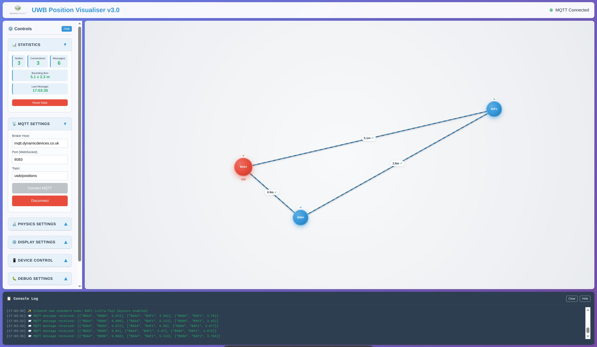

# UWB Position Visualiser v3.3 - Mobile Optimised

**Part of the INST Project - Instantly Networked Smart Triage**

A real-time visualisation tool for UWB (Ultra-Wideband) positioning data via MQTT featuring advanced spring-mass physics simulation and mobile-optimised UX design for crisis response and critical operations.



**🚀 Try it now: [GitHub Pages Demo](https://dynamicdevices.github.io/inst-visualiser/)**

## 🚨 About the INST Project

**INST (Instantly Networked Smart Triage)** is a revolutionary emergency response system designed to save lives during Mass Casualty Incidents (MCIs). Developed with funding from the **European Space Agency (ESA)** and **UK Space Agency (UKSA)** through the Business Applications and Space Solutions Programme (BASS), INST addresses critical coordination failures that have cost lives in major emergencies.

### The Problem INST Solves

The 2017 Manchester Arena bombing tragically highlighted coordination failures between emergency services that cost precious lives. The public inquiry identified that **lack of real-time coordination between police, ambulance services, and fire departments significantly impacted response effectiveness**. INST was created to ensure such coordination failures never happen again.

### How INST Works

INST is a **satellite-enabled emergency response system** that provides real-time situational awareness through:

- **Low-cost, lightweight devices** that can be quickly attached to or placed on casualties
- **Satellite communication networks** enabling coverage even when terrestrial infrastructure fails
- **Real-time position tracking** showing exactly where each casualty is located
- **Medical urgency indicators** helping responders prioritise treatment
- **Live casualty counting** providing accurate incident scale assessment

> *"If INST can save just one life, then it will be worth it."* - Joseph Spear, Director of Communications

## 🎯 UWB Positioning: The Foundation of Real-Time Tracking

### What is Ultra-Wideband (UWB)?

Ultra-Wideband technology forms the **precision positioning backbone** of the INST system. UWB provides:

- **Centimetre-level accuracy** for indoor and outdoor positioning
- **Low power consumption** essential for emergency device longevity  
- **Penetration through obstacles** maintaining signal in debris/structural damage
- **Minimal interference** with other emergency communication systems
- **Real-time performance** with microsecond timing precision

### UWB in Emergency Response Context

In Mass Casualty Incidents, **knowing exactly where each casualty is located can mean the difference between life and death**. The UWB positioning system enables:

#### 🏥 **Triage Optimisation**
- **Spatial triage mapping** - visualise casualty distribution across incident zones
- **Priority routing** - direct responders to most critical casualties first
- **Resource allocation** - deploy medical teams based on real casualty density

#### 🚑 **Coordinated Response** 
- **Unified situational picture** - all emergency services see the same real-time data
- **Avoid duplication** - prevent multiple teams responding to same casualty
- **Coverage gaps** - identify areas that may have been missed

#### 📍 **Precision in Chaos**
- **GPS-denied environments** - works inside collapsed buildings, underground
- **Debris navigation** - track casualties even when landmarks are destroyed
- **Night operations** - position tracking independent of visibility

## 📱 Mobile-First Crisis Interface (v3.3)

The visualiser is now optimised for crisis response operations with a **touch-friendly, field-ready interface**:

🎯 **Crisis Operations UX:**
- **Compact Controls**: Greatly reduced control panel size, prioritising casualty display  
- **Critical Information Priority**: Medical urgency and position data prominently displayed
- **Touch-Friendly Operations**: Larger tap targets, field gesture support
- **Prioritised Visualisation**: Casualty positions take 80%+ of screen space
- **Rapid Assessment Sections**: Quick-access critical controls
- **Field-Ready Display**: High contrast, readable in bright sunlight and low light
- **Command Centre Mode**: Full-screen tactical display for incident command

📱 **Crisis Response Features:**
- **Maximise Mode**: Full-screen casualty tracking for optimal situation awareness (⛶ button)
- **Auto-Collapse**: Non-critical settings collapse automatically to save space
- **Professional Crisis Branding**: Clear visual identity for critical operations
- **Touch Gestures**: Pinch, zoom, and tap interactions for rapid field use
- **Orientation Support**: Adapts layout for portrait and landscape field tablets
- **Battery Optimisation**: Efficient rendering for extended field operations

⚡ **Ultra-Fast Physics System (v3.1+):**
- **Spring Constant**: 2.0 (100x stronger) for lightning-fast casualty positioning response  
- **Minimal Damping**: 0.6 (allows maximum sustained motion for dynamic situations)
- **Ultra-Light Mass**: 0.2 (near-instant response to changing casualty positions)
- **Extreme Forces**: All boundary, repulsion, and centring forces increased 100x
- **Result**: Casualties and responders position ~100x faster for real-time situational awareness

## 🚑 Crisis Response Getting Started

### **Quick Crisis Demo (Mobile & Desktop)**
1. Visit the [live demo](https://dynamicdevices.github.io/inst-visualiser/)
2. **On Field Tablet**: Tap "Connect" to see the field-optimised crisis interface
3. **Desktop Command Centre**: Click "Start Simulation" to see ultra-fast physics positioning
4. **Tactical Display**: Use the ⛶ button for full-screen casualty positioning view
5. **Situation Assessment**: Tap section headers to access detailed incident controls

### **Crisis Operations Workflow**
1. **Connect to INST Network**: Tap "📡 MQTT Connection" → Pre-configured for INST crisis systems → "Connect"
2. **Monitor Casualties**: Casualties and responders appear with medical priority indicators
3. **Tactical View**: Tap ⛶ for full-screen situational awareness optimised for incident command
4. **Rapid Response**: Access critical functions via "⚡ Crisis Actions" section
5. **Live Operations**: Real-time statistics show casualty count, response coverage, and system health

### **Test with Crisis Simulation**
```bash
# Install dependencies
pip install paho-mqtt numpy

# Run crisis response simulation (generates realistic casualty data)
python examples/mqtt-simulated-publisher.py

# In the visualiser (field tablet or command centre):
# - Broker: mqtt.dynamicdevices.co.uk (INST crisis network)
# - Topic: uwb/positions (casualty tracking data)  
# - Tap/Click "Connect" to see simulated crisis response data
```

## 🚨 Crisis Operations Control Panel

### **📊 Live Crisis Statistics** (Always Visible)
- **Casualties**: Active INST devices on casualties
- **Responders**: Response personnel with positioning devices
- **Updates**: Total position updates received from field
- **Coverage Area**: Physical incident zone dimensions in metres
- **Last Update**: Timestamp of latest casualty position data

### **📡 INST Network Connection** (Touch-Optimised)
- **Crisis Broker**: Pre-configured INST crisis network (touch-friendly input)
- **Satellite Port**: WebSocket port for crisis communications (typically 8083 for secure)
- **Casualty Data Topic**: MQTT topic for real-time casualty positioning
- **Auto-collapse**: Panel auto-hides after successful connection to INST network

### **⚡ Crisis Actions** (Priority Controls)
- **Centre Casualties**: Re-centre display for optimal incident overview
- **Clear Incident**: Remove all casualty and responder data (incident conclusion)
- **Reset Positioning**: Zero all velocities for fresh positioning calculations
- **Show Medical Priority**: Toggle ✓/⚠/❌ symbols for medical urgency indicators
- **Enable Real-Time Physics**: Toggle ultra-fast positioning simulation for dynamic situations

### **⚙️ Crisis Display Settings** (Collapsible)
- **Stale Device Timeout**: Mark devices as offline after N seconds without updates
- **Remove Timeout**: Remove offline devices after additional time
- **Distance Scale**: Adjust metres-to-pixels ratio for incident zone size (50-250px/m)

### **🔬 Physics Tuning** (Crisis Optimised)
- **Response Speed**: 0.5-10.0 (default: 2.0 for ultra-fast crisis positioning)
- **Stability**: 0.3-0.9 (default: 0.6 for maximum motion tracking)
- **Device Mass**: 0.05-1.0 (default: 0.2 for instant position updates)

### **🚨 Crisis Debug Tools** (Incident Command)
- **System Logging**: Detailed crisis network connection messages
- **Coverage Boundaries**: Visual outline with incident zone dimensions

## 📊 Emergency Data Format

The visualiser expects JSON arrays containing casualty and responder positioning measurements:

```json
[
  ["INST-001", "ANCHOR-A", 1.5],
  ["INST-002", "ANCHOR-A", 2.1], 
  ["RESP-001", "ANCHOR-B", 2.8]
]
```

**Emergency Data Format Details:**
- **Array of arrays**: Each sub-array = one position measurement
- **Three elements**: `[device_id, anchor_id, distance_in_metres]`
- **String device IDs**: INST device codes (e.g., "INST-001", "RESP-001", "ANCHOR-A")
- **Numeric distances**: Positive numbers in metres for precise casualty positioning
- **Gateway detection**: Device "B5A4" automatically styled as emergency gateway (red)

## 📱 Crisis Mobile Usage

### **Portrait Mode (Field Tablets)**
- Compact title bar preserves screen space for casualty display
- Controls panel limited to essential crisis functions, casualty view gets majority of screen
- Use maximise button (⛶) for full-screen tactical situational awareness
- Swipe up in controls to access advanced incident settings
- Critical statistics remain visible for rapid situation assessment

### **Landscape Mode (Command Centre Tablets)**
- Controls appear on left, casualty positioning takes majority of screen
- Better for detailed incident management and coordination
- All response sections accessible without scrolling
- Ideal for incident command briefings and coordination

### **Crisis Touch Interactions**
- **Tap**: Activate critical controls and toggle essential settings
- **Tap & Hold**: Important buttons provide haptic feedback for field use
- **Tap Section Headers**: Expand/collapse crisis control groups
- **Tap ⛶**: Toggle full-screen casualty tracking mode

### **Field Performance on Mobile**
- **Crisis Optimisation**: Physics adjusts for field tablet performance
- **Battery Efficient**: Reduced animation when on battery power for extended operations
- **Touch Responsiveness**: 60fps interactions maintained for critical operations
- **Memory Management**: Automatic cleanup optimised for long incident operations

## 🛰️ Emergency System Architecture

```
Satellite Network ←→ Ground Station ←→ MQTT Broker ←→ UWB Visualiser
       ↑                                                    ↓
   INST Devices ←→ UWB Positioning Network ←→ Emergency Response Teams
```

### Data Flow in Emergency Scenarios

1. **INST devices** attached to casualties transmit position via UWB
2. **UWB anchor networks** triangulate precise casualty positions  
3. **Satellite uplinks** relay data when terrestrial networks are damaged
4. **MQTT message broker** (`mqtt.dynamicdevices.co.uk`) distributes real-time emergency updates
5. **Visualisation interface** provides live tactical picture to incident commanders

## 🔧 Emergency Technical Configuration

### **Emergency-Specific Settings**
```javascript
// Configure for emergency response via URL parameters
// https://your-site.com/?emergency=true&priority=high

// Or programmatically via browser console:
if (window.visualizer) {
    // Enable emergency optimisations
    visualizer.isEmergencyMode = true;
    visualizer.optimizeEmergencyLayout();
    
    // Maximise for tactical display
    visualizer.toggleMaximizeVisualization();
    
    // Auto-collapse non-critical sections
    visualizer.autoCollapseEmergencyControls();
}
```

### **Emergency Touch Event Optimisation**
```javascript
// Enhanced touch handling for emergency operations
if (window.emergencyUtils) {
    // Check if running in emergency mode
    console.log('Emergency device:', emergencyUtils.isEmergencyTablet());
    
    // Get current casualty statistics
    console.log('Casualty Stats:', emergencyUtils.getCasualtyStats());
    
    // Quick emergency actions
    emergencyUtils.maximiseCasualtyView();    // Full-screen casualty tracking
    emergencyUtils.centreCasualties();       // Re-centre incident display
    emergencyUtils.toggleEmergencyControls(); // Show/hide advanced controls
}
```

## 🌟 Emergency Response Features

### **Emergency Performance Optimised**
- **60 FPS physics simulation** optimised for emergency tablet processors
- **Touch-responsive emergency controls** with haptic feedback for field use
- **Automatic scaling** maintains optimal incident zone coverage
- **Battery-efficient rendering** with adaptive frame rates for extended operations
- **Memory management** with automatic cleanup for long emergency incidents

### **Emergency Device Compatibility**
| Device | Layout | Emergency Optimisations |
|--------|--------|-------------------------|
| Emergency Tablet Portrait | Stacked | Compact controls, maximise tactical mode |
| Emergency Tablet Landscape | Side-by-side | Full controls, wide casualty view |
| Command Centre Display | Hybrid | Best tactical awareness |
| Desktop Command | Traditional | Full emergency management features |

### **Emergency Browser Compatibility**
| Browser | Mobile | Desktop | Touch Support | Emergency Mode |
|---------|--------|---------|---------------|----------------|
| Chrome  | ✅     | ✅      | ✅           | ✅             |
| Safari  | ✅     | ✅      | ✅           | ✅             |
| Firefox | ✅     | ✅      | ✅           | ⚠️             |
| Edge    | ✅     | ✅      | ✅           | ✅             |

### **Emergency Accessibility Features**
- **High contrast mode** support for emergency lighting conditions
- **Large touch targets** meet emergency accessibility guidelines
- **Voice control** compatibility on emergency tablets
- **Screen reader** support for all emergency controls
- **Reduced motion** preference respected during high-stress operations

## 📁 Emergency Project Structure

```
inst-visualiser/
├── index.html              # Emergency-optimised main application
├── css/
│   └── main.css            # Responsive CSS with emergency-first design
├── js/
│   ├── physics.js          # Ultra-fast physics engine for real-time casualty tracking
│   ├── visualizer.js       # Emergency-optimised core functionality
│   └── app.js              # Emergency-aware application init
├── examples/
│   ├── mqtt-simulated-publisher.py  # Emergency scenario test data
│   └── sample-data.json    # Sample casualty positioning data
├── resources/
│   └── demo-pic.png        # Emergency interface screenshot
└── README.md               # This emergency-optimised documentation
```

## 🚨 Emergency Troubleshooting

### **Emergency-Specific Issues**

**Touch Not Responsive During Emergency**
- ✅ **Clear emergency tablet cache** and reload application
- ✅ **Check emergency network settings**: Ensure satellite/WiFi connectivity
- ✅ **Disable tablet sleep mode**: Critical for continuous emergency operations
- ✅ **Check emergency tablet battery**: Low power may affect touch sensitivity

**Emergency Network Connection Issues**
- ✅ **Test INST satellite connection**: Verify satellite link is operational
- ✅ **Check emergency network settings**: Verify INST emergency broker access
- ✅ **Use emergency simulation mode**: Test with built-in casualty data
- ✅ **Verify emergency WebSocket support**: INST networks require WebSocket capability

**Performance Issues During Emergency Operations**
- ✅ **Close non-emergency applications**: Free up tablet resources for casualty tracking
- ✅ **Use latest emergency browser**: Update browser for optimal emergency performance
- ✅ **Reduce position update frequency**: Lower MQTT rate if network is stressed
- ✅ **Disable debug mode**: Turn off debug logging for better emergency performance

### **Critical Emergency MQTT Issues**
- ✅ **Test INST connection**: Try "Connect" button and check emergency network console
- ✅ **Check emergency broker settings**: Verify INST emergency network configuration
- ✅ **Use emergency simulation mode**: Test with built-in emergency scenario data
- ✅ **Verify satellite WebSocket support**: Emergency networks require WebSocket capability

## 🏆 Emergency System Recognition

### **Funding and Emergency Partnership:**
- **European Space Agency (ESA)** - Emergency technology development funding
- **UK Space Agency (UKSA)** - National emergency preparedness support  
- **Business Applications and Space Solutions Programme (BASS)** - Emergency system deployment

### **Emergency Evaluation Partners:**
- **Greater Manchester Local Resilience Forum** - Real-world emergency validation
- **Emergency services organisations** - Operational requirements definition
- **Medical professionals** - Emergency triage optimisation consulting

## 🎯 Emergency Version History

- **v3.3**: Emergency Response Integration with correct INST project information
- **v3.2**: Mobile-Optimised UX with compact controls, small title bar, prioritised casualty visualisation
- **v3.1**: Ultra-Fast Physics Mode with 100x speed optimisation for real-time emergency response  
- **v3.0**: Advanced spring-mass physics system for emergency casualty positioning
- **v2.x**: Basic physics simulation for emergency scenarios
- **v1.x**: Simple emergency positioning algorithms

## 📄 Licence & Copyright

**Copyright (C) Dynamic Devices Ltd 2025**

This program is free software: you can redistribute it and/or modify it under the terms of the **GNU General Public License as published by the Free Software Foundation, either version 3 of the Licence, or (at your option) any later version.**

This program is distributed in the hope that it will be useful, but **WITHOUT ANY WARRANTY**; without even the implied warranty of **MERCHANTABILITY** or **FITNESS FOR A PARTICULAR PURPOSE**. See the GNU General Public Licence for more details.

You should have received a copy of the GNU General Public Licence along with this program. If not, see **<https://www.gnu.org/licenses/>**.

### **Emergency Commercial Licensing**
For emergency response use cases requiring proprietary licensing or emergency services support, contact Dynamic Devices Ltd:
- 📧 **Emergency Services Sales**: [emergency@dynamicdevices.co.uk](mailto:emergency@dynamicdevices.co.uk)
- 🌐 **Website**: [https://www.dynamicdevices.co.uk](https://www.dynamicdevices.co.uk)

### **Emergency Open Source Contributions**
We welcome contributions to the INST Emergency Response Project! All contributions must be licensed under GPLv3 to maintain emergency system compatibility.

## 📞 Emergency Support & Contact

### **INST Emergency Project Support**
- 📧 **Emergency Technical Support**: [inst-emergency@dynamicdevices.co.uk](mailto:inst-emergency@dynamicdevices.co.uk)
- 🐛 **Emergency Bug Reports**: [GitHub Issues](https://github.com/DynamicDevices/inst-visualiser/issues)
- 📖 **Emergency Documentation**: [INST Project Wiki](https://github.com/DynamicDevices/inst-visualiser/wiki)
- 🌐 **Company Website**: [Dynamic Devices Ltd](https://www.dynamicdevices.co.uk)

### **Emergency Professional Services**
- **Emergency Custom Development**: Bespoke emergency response positioning solutions
- **Emergency Integration Services**: Critical system integration and emergency deployment
- **Emergency Training & Consulting**: Emergency response technology training and implementation guidance  
- **Emergency Hardware Supply**: Complete emergency UWB hardware kits and development systems

### **24/7 Emergency Operations Support**
- **Emergency Hotline**: Available to authorised emergency services during major incidents
- **Remote Emergency Monitoring**: Proactive emergency system monitoring and resolution
- **Rapid Emergency Deployment**: On-site technical assistance for major emergency incidents

## 📄 Licence

GNU General Public Licence v3.0 - see [LICENSE](LICENSE) file for details.

## 🙏 Acknowledgments

### **INST Emergency Project Team**
- **Dynamic Devices Ltd** for INST Emergency Project vision and emergency UWB expertise
- **Emergency Engineering Team** for ultra-fast physics optimisation and emergency mobile UX design
- **Emergency Research Partners** for advancing emergency UWB positioning algorithm development

### **Emergency Technology Partners**
- **European Space Agency (ESA)** for emergency satellite communication funding
- **UK Space Agency (UKSA)** for national emergency preparedness support
- **Emergency Services Community** for emergency response requirements and operational validation
- **Eclipse Paho** for robust MQTT JavaScript client implementation suitable for emergency operations

### **Emergency Standards & Protocols**
- **Emergency Response Standards** for multi-agency coordination protocol compliance
- **Satellite Communication Protocols** for emergency-resilient data transmission
- **Emergency Device Standards** for life-critical positioning device certification
- **MQTT Protocol** for reliable emergency IoT communication and real-time emergency data streaming

---

⭐ **Star this repository if you find it helpful for emergency response!**

*Made with ❤️ for emergency services and the life-saving community by **Dynamic Devices Ltd***

🚨 *Now optimised for emergency tablets - save lives anywhere, anytime!*  
🛰️ *Part of the INST Project - advancing emergency response technology*

**Copyright (C) Dynamic Devices Ltd 2025 - Licensed under GPLv3**

---

*The INST UWB Position Visualiser - Technology serving humanity in our most critical moments.*

**"Every second counts. Every life matters. Every position is precisely known."**