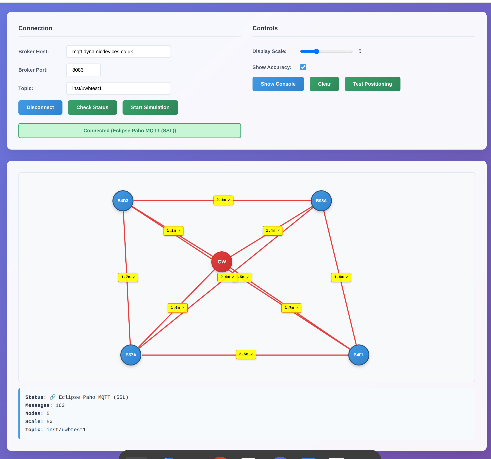

# INST Tag Visualizer v1.4

A real-time visualization tool for UWB (Ultra-Wideband) positioning data via MQTT. Displays nodes and their distance relationships with accurate geometric positioning and smooth animations.



## 🎥 Live Demo

**Try it now:** [GitHub Pages Demo](https://dynamicdevices.github.io/inst-tag-visualizer/)

### Demo Animation Description
The visualizer creates an engaging real-time experience:

1. **🎮 Simulation Mode**: Click "Start Simulation" to see:
   - Nodes appearing with smooth pulse animations
   - Red gateway nodes (marked "GW") with special effects  
   - Blue standard nodes with rotating data labels
   - Connection lines dynamically adjusting during movement
   - Distance labels showing real MQTT measurements (e.g., "2.5m ✓")

2. **📐 Geometric Positioning**: Watch as nodes arrange themselves:
   - 2 nodes: Perfect linear spacing at exact distances
   - 3 nodes: Precise triangle geometry using law of cosines
   - 4+ nodes: Force-directed layout optimizing all distances
   - Smooth 2-second animations with connections following nodes

3. **⚡ Live MQTT Feed**: Connect to see real positioning data:
   - Instant node creation for new tags
   - Real-time distance updates with accuracy indicators
   - Fast message mode (disables animations for performance)
   - Console logging showing every distance measurement

## Features

### 🔗 MQTT Connectivity
- **Eclipse Paho MQTT client** with SSL/TLS support
- **WebSocket connections** for browser compatibility
- **Auto-reconnection** and subscription management
- **QoS support** and retained message handling
- **Comprehensive error handling** with helpful diagnostics

### 🎯 Smart Positioning
- **Geometric triangle positioning** for 3 nodes using exact math
- **Force-directed layout** for 4+ nodes with spring physics
- **Accurate distance scaling** (configurable: 50px = 1 meter default)
- **Boundary constraints** keeping nodes within visualization area
- **Real-time layout optimization** as new measurements arrive

### 🎨 Visual Features
- **Gateway node detection** (red "GW" styling for node "B5A4")
- **Smooth CSS + JS animations** with connection following
- **Distance accuracy indicators** (✓ good, ⚠ approximated)
- **Interactive console** with color-coded logging
- **Responsive design** for desktop and mobile
- **Dark/light theme** console with syntax highlighting

### 🎮 Testing & Development
- **Simulation mode** generating realistic test data
- **Sample data testing** with known triangle geometry
- **Node verification** tool with DOM inspection
- **Connection status** monitoring and diagnostics
- **Performance metrics** and fast message detection

## Quick Start

### 🚀 Option 1: Download and Run
```bash
# Clone the repository
git clone https://github.com/yourusername/inst-tag-visualizer.git
cd inst-tag-visualizer

# Serve locally (choose one)
npm start                    # Uses http-server
python3 -m http.server 8080  # Python built-in
# Or just open index.html in your browser
```

### 🌐 Option 2: Use GitHub Pages
Visit the [live demo](https://yourusername.github.io/inst-tag-visualizer/) and start immediately.

### 🧪 Testing Without Hardware
1. Open the visualizer
2. Click **"Start Simulation"** to see demo data
3. Click **"Test Positioning"** for triangle geometry example
4. Click **"Show Console"** to see detailed logs

### 📡 Connect to Real MQTT Data
1. Configure your MQTT broker settings:
   - **Host**: `your-mqtt-broker.com`
   - **Port**: `8083` (WebSocket SSL port)
   - **Topic**: `your/positioning/topic`
2. Click **"Connect"**
3. Ensure your data format matches: `[["node1","node2",1.5], ["node2","node3",2.1]]`

## MQTT Data Format

The visualizer expects JSON arrays containing distance measurements:

```json
[
  ["B5A4", "Room1", 2.0],
  ["Room1", "Room2", 1.5], 
  ["Room2", "Room3", 3.2],
  ["B5A4", "Room3", 2.8]
]
```

### Format Specification
- **Array of arrays**: Each sub-array represents one distance measurement
- **Three elements**: `[node_id_1, node_id_2, distance_in_meters]`
- **String node IDs**: Any string identifier (e.g., "A", "Room1", "B5A4")
- **Numeric distances**: Positive numbers in meters
- **Special handling**: Node "B5A4" automatically styled as gateway

### Example UWB Integration
```python
# Python example: Publishing UWB data
import paho.mqtt.client as mqtt
import json

# Your UWB distance measurements
distances = [
    ["anchor1", "tag1", 2.34],
    ["anchor1", "tag2", 4.56], 
    ["anchor2", "tag1", 1.78]
]

# Publish to MQTT
client = mqtt.Client()
client.connect("your-broker.com", 1883)
client.publish("uwb/distances", json.dumps(distances))
```

## Configuration

### Display Settings
- **Scale**: 1x to 20x (adjusts pixel-to-meter ratio)
- **Accuracy indicators**: Toggle ✓/⚠ symbols on/off
- **Console logging**: Show/hide detailed debug information

### MQTT Settings
- **Broker host**: Your MQTT broker address
- **Port**: WebSocket port (typically 8083 for SSL, 8080 for plain)
- **Topic**: MQTT topic publishing position data
- **SSL**: Automatically enabled for secure connections

### Performance Settings
- **Fast message mode**: Auto-disables animations for high-frequency data (>2Hz)
- **Animation duration**: 2-second smooth transitions
- **Layout optimization**: Triggers on distance changes >0.1m

## Technology Stack

### Frontend
- **HTML5** with semantic markup and accessibility
- **CSS3** with custom properties, grid, and animations
- **Vanilla JavaScript** (ES6+) with modular architecture
- **Responsive design** using CSS Grid and Flexbox

### MQTT Integration
- **Eclipse Paho JavaScript** client for WebSocket MQTT
- **SSL/TLS support** for secure connections
- **Automatic reconnection** and subscription management
- **QoS handling** and retained message support

### Positioning Algorithms
- **Triangle geometry**: Law of cosines for 3-node exact positioning
- **Force-directed layout**: Spring physics simulation for 4+ nodes
- **Constraint satisfaction**: Boundary keeping and collision avoidance
- **Animation interpolation**: Ease-in-out curves with connection following

## Browser Compatibility

| Browser | Version | WebSocket | MQTT SSL | Animations |
|---------|---------|-----------|----------|------------|
| Chrome  | 60+     | ✅        | ✅       | ✅         |
| Firefox | 55+     | ✅        | ✅       | ✅         |
| Safari  | 11+     | ✅        | ✅       | ✅         |
| Edge    | 79+     | ✅        | ✅       | ✅         |

### Accessibility Features
- **ARIA labels** for screen readers
- **High contrast mode** support
- **Reduced motion** preference respect
- **Keyboard navigation** for controls
- **Color-blind friendly** status indicators

## Development

### Project Structure
```
inst-tag-visualizer/
├── index.html              # Main HTML file
├── css/
│   └── styles.css          # All styles and animations
├── js/
│   └── visualizer.js       # Main application logic
├── docs/
│   ├── API.md              # MQTT API documentation
│   ├── DEPLOYMENT.md       # Deployment guide
│   └── TROUBLESHOOTING.md  # Common issues and solutions
├── examples/
│   ├── mqtt-publisher.py   # Python MQTT example
│   ├── sample-data.json    # Test data samples
│   └── integration.md      # Integration examples
├── package.json            # NPM configuration
├── README.md               # This file
└── LICENSE                 # MIT license
```

### Development Scripts
```bash
npm install          # Install dev dependencies
npm start           # Start local server
npm run lint        # Check code quality
npm run dev         # Development mode with live reload
```

### Version History
- **v1.4**: Improved accuracy tolerance, added accuracy toggle control
- **v1.3**: Enhanced connection animation during node movement  
- **v1.2**: Performance improvements and bug fixes
- **v1.1**: Real-time connection updates during animations
- **v1.0**: Initial release with MQTT connectivity and basic positioning

### API Documentation
See [docs/API.md](docs/API.md) for detailed MQTT API specification and integration examples.

## Deployment

### GitHub Pages
1. Enable GitHub Pages in repository settings
2. Select "Deploy from a branch" → `main` branch
3. Your visualizer will be available at `https://yourusername.github.io/inst-tag-visualizer/`

### Custom Hosting
1. Upload files to any web server
2. Ensure HTTPS for MQTT SSL connections
3. Configure CORS headers if needed for MQTT broker access

### Docker Deployment
```dockerfile
FROM nginx:alpine
COPY . /usr/share/nginx/html
EXPOSE 80
```

See [docs/DEPLOYMENT.md](docs/DEPLOYMENT.md) for detailed deployment instructions.

## Troubleshooting

### Common Issues

**MQTT Connection Fails**
- ✅ Check broker URL and port (WebSocket port, usually 8083)
- ✅ Verify SSL certificate validity
- ✅ Ensure CORS headers allow your domain
- ✅ Test with "Start Simulation" to verify visualizer works

**Nodes Don't Position Correctly**
- ✅ Verify JSON format: `[["node1","node2",1.5]]`
- ✅ Check distance values are positive numbers
- ✅ Try "Test Positioning" for known good data
- ✅ Adjust display scale (1x-20x) for better visibility

**Performance Issues**
- ✅ Fast message mode automatically disables animations
- ✅ Reduce message frequency if possible (<2Hz recommended)
- ✅ Use modern browser with hardware acceleration
- ✅ Check console for error messages

See [docs/TROUBLESHOOTING.md](docs/TROUBLESHOOTING.md) for comprehensive troubleshooting guide.

## Contributing

We welcome contributions! Please see our [Contributing Guide](CONTRIBUTING.md) for details.

### Development Setup
1. Fork the repository
2. Create a feature branch: `git checkout -b feature/amazing-feature`
3. Make your changes and test thoroughly
4. Submit a pull request with description

### Code Standards
- Use ESLint configuration provided
- Follow existing code style and patterns
- Add JSDoc comments for new functions
- Test with both MQTT and simulation data
- Ensure accessibility compliance

## License

MIT License - see [LICENSE](LICENSE) file for details.

## Support

- 📧 **Email**: your.email@example.com
- 🐛 **Issues**: [GitHub Issues](https://github.com/yourusername/inst-tag-visualizer/issues)
- 💬 **Discussions**: [GitHub Discussions](https://github.com/yourusername/inst-tag-visualizer/discussions)
- 📖 **Documentation**: [docs/](docs/) folder

## Acknowledgments

- **Eclipse Paho** for robust MQTT JavaScript client
- **UWB Community** for positioning algorithm insights  
- **Contributors** who helped improve the visualizer

---

**⭐ Star this repository if you find it helpful!**

Made with ❤️ for the IoT and positioning community.
