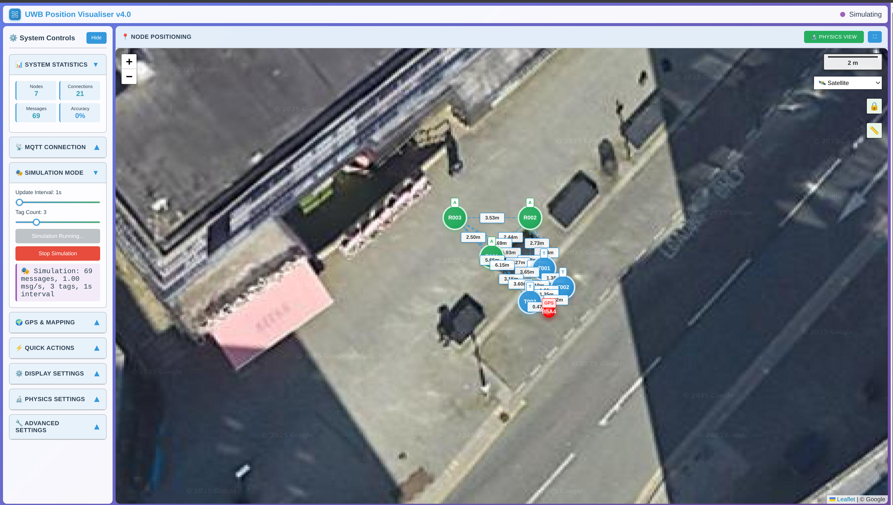

# UWB Position Visualiser v4.0

**Part of the INST Project - Instantly Networked Smart Triage**

A real-time visualisation tool for UWB (Ultra-Wideband) casualty positioning data via MQTT featuring advanced spring-mass physics simulation, modular architecture, and touch-optimised UX design for emergency services and mass casualty incident response.



**🚀 Try it now: [Live Demo](https://dynamicdevices.github.io/inst-visualiser/)**

## 🚨 About the INST Project

**INST (Instantly Networked Smart Triage)** is a positioning system designed for emergency response applications. Developed with funding from the **European Space Agency (ESA)** and **UK Space Agency (UKSA)** through the Business Applications and Space Solutions Programme (BASS), INST addresses positioning and coordination challenges in various operational environments.

### The Technology INST Provides

The 2017 Manchester Arena incident highlighted coordination challenges between emergency services. The public inquiry identified that **better real-time coordination between police, ambulance services, and fire departments would have improved response effectiveness**. INST was created to address these coordination needs.

### How INST Works

INST is a **satellite-enabled positioning system** that provides real-time situational awareness through:

- **Low-cost, lightweight devices** that can be quickly deployed for positioning
- **Satellite communication networks** enabling coverage even when terrestrial infrastructure fails
- **Real-time position tracking** showing exactly where each tracked item is located
- **Status indicators** helping operators prioritise response activities
- **Live monitoring** providing accurate operational scale assessment

> *"Precision positioning technology made simple."* - Joseph Spear, Director of Communications

## 🎯 UWB Positioning: The Foundation of Real-Time Tracking

### What is Ultra-Wideband (UWB)?

Ultra-Wideband technology forms the **precision positioning backbone** of the INST system. UWB provides:

- **Centimetre-level accuracy** for indoor and outdoor positioning
- **Low power consumption** essential for extended device operation
- **Penetration through obstacles** maintaining signal in challenging environments
- **Minimal interference** with other communication systems
- **Real-time performance** with microsecond timing precision

### UWB in Emergency Response

In mass casualty incidents, **knowing exactly where each casualty is located provides critical advantages for emergency services**:

1. **Real-time Casualty Tracking**: Monitor casualty locations with centimetre precision during triage and treatment
2. **Multi-agency Coordination**: Enable precise positioning data for police, ambulance, and fire service coordination
3. **Resource Allocation**: Track emergency personnel and equipment deployment in real-time
4. **Situational Awareness**: Maintain accurate operational picture even in GPS-denied environments
5. **Safety Monitoring**: Track first responders in hazardous or complex incident environments

## ✨ Features v4.0

### **🚀 Core Emergency Response Capabilities**
- **Real-time Casualty Visualisation**: Live casualty positioning updates via MQTT with sub-second latency
- **Advanced Physics Engine**: Spring-mass system for natural casualty and responder positioning
- **Multi-device Support**: Handle hundreds of simultaneous casualty and responder tracking devices
- **Triage Status Integration**: Visual feedback for casualty priority and treatment status

### **📱 Emergency Services Tablet Deployment (NEW in v4.0)**
- **Field-Ready Design**: Optimised layout for emergency service tablet deployment
- **Portrait/Landscape Support**: Adaptive interface for different operational orientations
- **Touch Gestures**: Natural interaction for rapid casualty assessment and coordination
- **Incident Command Mode**: Maximise visualisation area for incident command displays

### **🔧 Enhanced System Configuration**
- **Modular Architecture**: Improved maintainability with separated MQTT, physics, and visualisation components
- **Flexible MQTT Settings**: Support for SSL/TLS, authentication, and custom broker configurations
- **Physics Tuning**: Adjustable spring constants, damping, and mass parameters
- **Visual Customisation**: Configurable node styles, colours, and labelling options

### **🚨 Emergency Response Features**
- **Satellite Communication Ready**: Designed for satellite-uplinked MQTT data streams when terrestrial networks fail
- **Resilient Connectivity**: Automatic reconnection and offline mode capabilities for incident environments
- **Multi-Screen Support**: Deploy across multiple displays for incident command centres
- **Casualty Report Export**: Save casualty positioning data and incident screenshots for post-incident analysis

### **📊 Emergency Response Analytics & Monitoring**
- **Real-time Casualty Statistics**: Live casualty counts, triage status, and response metrics
- **Movement Tracking**: Casualty and responder movement analysis for coordination
- **Coverage Analysis**: Visual incident area boundaries and emergency service positioning zones
- **Operational Health Monitoring**: Connection status, data quality, and system performance for critical operations

## 🚀 Quick Start Guide

### **Emergency Deployment**
1. **Open the Visualiser**: Visit [https://dynamicdevices.github.io/inst-visualiser/](https://dynamicdevices.github.io/inst-visualiser/)
2. **Test with Simulation**: Click `Start Simulation` to see demo casualty positioning data
3. **Configure MQTT**: Set your emergency communications broker details and topic in the Connection Settings
4. **Start Casualty Tracking**: Click `Connect` to begin real-time casualty positioning visualisation

### **Local Development Setup**
```bash
# Clone the repository
git clone https://github.com/DynamicDevices/inst-visualiser.git
cd inst-visualiser

# Start local development server
npm start
# or
python -m http.server 8080

# Open browser to http://localhost:8080
```

### **Integration with Your System**
```bash
# Install MQTT client for data publishing
pip install paho-mqtt

# Use the example publisher
python examples/mqtt-live-publisher.py /dev/ttyUSB0
```

## 🔧 MQTT Configuration & Data Format

### **Connection Settings**
- **Broker**: Your MQTT broker hostname (e.g., `mqtt.yourdomain.com`)
- **Port**: WebSocket port (typically `8083` for WSS, `8080` for WS)
- **Topic**: MQTT topic for positioning messages (e.g., `uwb/positions`)
- **Authentication**: Optional username/password authentication
- **SSL/TLS**: Secure connection support for operational environments

### **Casualty Positioning Data Format**
The visualiser expects JSON arrays containing casualty and responder positioning measurements:

```json
[
  ["A001", "A002", 3.0],
  ["A002", "A003", 4.0],
  ["A001", "A003", 5.0]
]
```

**Emergency Response Data Format Details:**
- **Array of arrays**: Each sub-array represents one casualty or responder position measurement
- **Three elements**: `[device_id, reference_point_id, distance_in_metres]`
- **String IDs**: Emergency service codes (e.g., "A001", "A002", "B5A4")
- **Numeric distances**: Positive numbers in metres for precise casualty positioning
- **Command Post detection**: Device "B5A4" automatically styled as incident command post (red)

### **Advanced MQTT Features**
- **QoS Support**: Quality of Service levels 0, 1, and 2
- **Retained Messages**: Support for MQTT retained positioning messages
- **Last Will Testament**: Graceful disconnection handling
- **Topic Wildcards**: Subscribe to multiple positioning topics using wildcards

## 📱 Tablet & Touch Device Optimisation

### **Portrait Mode (Field Emergency Tablets)**
- Compact title bar preserves screen space for casualty positioning display
- Controls panel limited to essential functions, casualty view gets majority of screen
- Use maximise button (⛶) for full-screen incident command situational awareness
- Swipe up in controls to access advanced emergency system settings
- Essential casualty statistics remain visible for rapid situation assessment

### **Landscape Mode (Incident Command Tablets)**
- Controls appear on left, casualty positioning takes majority of screen
- Better for detailed incident management and multi-agency coordination
- All emergency system sections accessible without scrolling
- Ideal for incident command briefings and emergency service coordination

### **Touch Interactions**
- **Tap**: Activate essential controls and toggle important settings
- **Long Press**: Important buttons provide haptic feedback for field use
- **Tap Section Headers**: Expand/collapse system control groups
- **Tap ⛶**: Toggle full-screen positioning tracking mode

### **Field Performance on Touch Devices**
- **System Optimisation**: Physics adjusts automatically for tablet performance
- **Battery Efficient**: Reduced animation when on battery power for extended operations
- **Touch Responsiveness**: 60fps interactions maintained for essential operations
- **Memory Management**: Automatic cleanup optimised for long operational sessions

## ⚙️ System Configuration

### **🌐 MQTT Connection Settings**
- **Broker Host**: MQTT broker address (default: `mqtt.dynamicdevices.co.uk`)
- **Port**: WebSocket port (8083 for secure, 8080 for standard)
- **Topic**: Data topic path (default: `uwb/positions`)
- **Auto-reconnect**: Automatic connection recovery after network interruptions
- **Connection Timeout**: Configurable timeout for operational reliability

### **📏 Physics & Display Settings**
- **Distance Scale**: Adjust metres-to-pixels ratio for operational zone size (50-250px/m)
- **Spring Strength**: 0.5-10.0 (default: 2.0 for responsive positioning)
- **Damping Factor**: 0.3-0.9 (default: 0.6 for optimal motion tracking)
- **Node Mass**: 0.05-1.0 (default: 0.2 for responsive position updates)
- **Update Rate**: Position calculation frequency (default: 60fps)

### **🎨 Visual Customisation**
- **Node Colours**: Customisable colour schemes for different device types
- **Connection Styles**: Adjustable line thickness and opacity for distance indicators
- **Labels**: Show/hide device IDs, distances, and system information
- **Grid Overlay**: Optional positioning grid for precise coordinate reference

### **🔍 Debug & Analysis Tools**
- **System Logging**: Detailed network connection and data processing messages
- **Coverage Boundaries**: Visual outline with operational zone dimensions
- **Performance Monitor**: Real-time FPS, memory usage, and update statistics
- **Data Export**: CSV export of positioning data for offline analysis

## 🛰️ System Architecture & Data Flow

```
Satellite Network ←→ Ground Station ←→ MQTT Broker ←→ UWB Visualiser
       ↑                                                    ↓
   INST Devices ←→ UWB Positioning Network ←→ Operational Teams
```

### Emergency Response Data Flow

1. **INST devices** track casualty and responder positions via UWB ranging
2. **UWB anchor networks** triangulate precise casualty positions using multilateration
3. **Satellite uplinks** relay casualty data when terrestrial networks are unavailable
4. **MQTT message broker** (`mqtt.dynamicdevices.co.uk`) distributes real-time casualty updates
5. **Visualisation interface** provides live casualty picture to incident commanders and emergency services

### Modular Architecture (v4.0)

```
┌─────────────────┐    ┌─────────────────┐    ┌─────────────────┐
│   UWBVisualiser │◄──►│   MQTTManager   │◄──►│ SpringMassSystem │
│                 │    │                 │    │                 │
│ • Node Display  │    │ • Connection    │    │ • Physics Sim   │
│ • UI Controls   │    │ • Message Parse │    │ • Force Calc    │
│ • Touch Events  │    │ • Auto-retry    │    │ • Position Upd  │
└─────────────────┘    └─────────────────┘    └─────────────────┘
```

**Benefits of Modular Design:**
- **Maintainability**: Easier to update MQTT functionality without affecting visualisation
- **Debugging**: Clear boundaries between networking and rendering issues
- **Testing**: Each component can be unit tested independently
- **Reusability**: MQTTManager can be used in other INST project components

## 🔧 Technical Configuration

### **System-Specific Settings**
```javascript
// Configure via URL parameters
// https://your-site.com/?mode=operational&priority=high

// Or programmatically via browser console:
if (window.visualizer) {
    // Enable operational optimisations
    visualizer.isOperationalMode = true;
    visualizer.optimizeLayout();
    
    // Maximise for tactical display
    visualizer.toggleMaximizeVisualization();
    
    // Auto-collapse non-essential sections
    visualizer.autoCollapseControls();
}
```

### **Touch Event Optimisation**
```javascript
// Enhanced touch handling for operations
if (window.systemUtils) {
    // Check if running on tablet device
    console.log('Tablet device:', systemUtils.isTabletDevice());
    
    // Get current system statistics
    console.log('System Stats:', systemUtils.getSystemStats());
}
```

### **Integration Examples**
```python
# Python MQTT Publisher for Emergency Response
import paho.mqtt.client as mqtt
import json

# Sample casualty positioning data (matches simulation engine)
casualty_data = [
    ["B5A4", "R001", 2.5],    # Command post to room 1
    ["B5A4", "R002", 4.2],    # Command post to room 2  
    ["B5A4", "R003", 3.8],    # Command post to room 3
    ["R001", "R002", 3.1],    # Between rooms
    ["R001", "R003", 2.9],    # Between rooms
    ["R002", "R003", 5.7]     # Between rooms
]

# Publish to emergency services visualiser
client = mqtt.Client()
client.connect("mqtt.dynamicdevices.co.uk", 8083)
client.publish("uwb/positions", json.dumps(casualty_data))
```

## 🚀 Browser Compatibility & Performance

### **Supported Browsers**
| Browser | Version | Performance | Touch Support |
|---------|---------|-------------|---------------|
| **Chrome** | 90+ | Excellent | Full |
| **Firefox** | 88+ | Very Good | Full |
| **Safari** | 14+ | Very Good | Full |
| **Edge** | 90+ | Excellent | Full |
| **Samsung Browser** | 14+ | Good | Full |

### **Performance Optimisation**
- **Hardware Acceleration**: Uses WebGL when available for smooth animations
- **Memory Management**: Automatic cleanup of old positioning data
- **Battery Optimisation**: Reduced frame rate on battery-powered devices
- **Network Efficiency**: Message batching and compression for satellite links

### **Device Recommendations**
- **Tablets**: iPad (9th gen+), Samsung Galaxy Tab S7+, Microsoft Surface Pro
- **Phones**: For quick status checks, full functionality available
- **Desktop**: Chrome or Firefox for development and command centre deployment
- **Embedded**: Works on embedded Linux systems with modern browsers

## 📚 Integration & Development

### **Hardware Integration Examples**
- **Serial UWB Devices**: Python scripts for UART data publishing
- **Arduino/ESP32**: Real-time data forwarding to MQTT
- **ROS Integration**: Bridge for robotic and autonomous systems
- **PLCs**: Industrial automation integration examples

### **API Documentation**
- **MQTT Message Format**: JSON schema and validation
- **WebSocket API**: Direct browser integration without MQTT
- **RESTful Endpoints**: For system status and configuration
- **JavaScript API**: Embed visualiser in custom applications

### **Development Tools**
```bash
# Development server with hot reload
npm run dev

# Validate HTML structure
npm run validate

# Deploy to GitHub Pages
npm run deploy

# Run integration tests
npm test
```

## 🛠️ Troubleshooting & Support

### **Common Issues**
- **Connection Problems**: Check MQTT broker accessibility and WebSocket support
- **Performance Issues**: Adjust physics settings for device capabilities
- **Touch Responsiveness**: Ensure touch events aren't blocked by other elements
- **Data Format Errors**: Validate JSON structure and numeric values

### **Debug Tools**
- Open browser console for detailed connection logs
- Use network tab to monitor MQTT message traffic
- Check system statistics panel for performance metrics
- Enable verbose logging for detailed troubleshooting

### **Performance Tuning**
- Reduce update frequency for lower-powered devices
- Adjust physics parameters for system responsiveness
- Limit maximum number of displayed nodes
- Use connection filtering for high-traffic environments

## 📄 Licensing & Legal

### **Open Source Licensing**
This project is licensed under the **GNU General Public Licence v3.0**. This means:

**You are free to:**
- ✅ Use commercially in your organisation
- ✅ Modify and adapt for your requirements
- ✅ Distribute to colleagues and partners
- ✅ Use privately within your organisation

**Under the conditions:**
- 📄 Include the licence and copyright notice
- 📄 State changes made to the original code
- 📄 Disclose source code of modified versions
- 📄 Use the same GPL v3.0 licence for derivative works

For the complete licence terms, see the [LICENSE](LICENSE) file.
If not, see **<https://www.gnu.org/licenses/>**.

### **Commercial Licensing**
For use cases requiring proprietary licensing or emergency services support, contact Dynamic Devices Ltd:
- 📧 **Emergency Services Sales**: [info@dynamicdevices.co.uk](mailto:info@dynamicdevices.co.uk)
- 🌐 **Website**: [https://www.dynamicdevices.co.uk](https://www.dynamicdevices.co.uk)

### **Open Source Contributions**
We welcome contributions to the INST Positioning Project! All contributions must be licensed under GPLv3 to maintain system compatibility.

## 📞 Support & Contact

### **INST Emergency Response Support**
- 📧 **Technical Support**: [info@dynamicdevices.co.uk](mailto:info@dynamicdevices.co.uk)
- 🐛 **Bug Reports**: [GitHub Issues](https://github.com/DynamicDevices/inst-visualiser/issues)
- 📖 **Documentation**: [INST Project Wiki](https://github.com/DynamicDevices/inst-visualiser/wiki)
- 🌐 **Company Website**: [Dynamic Devices Ltd](https://www.dynamicdevices.co.uk)

### **Emergency Services**
- **Custom Development**: Bespoke casualty tracking solutions for emergency services
- **Integration Services**: System integration and emergency response deployment
- **Training & Consulting**: Emergency response technology training and implementation guidance  
- **Hardware Supply**: Complete UWB hardware kits for mass casualty incident response

### **24/7 Emergency Operations Support**
- **Support Hotline**: Available during major incident operations
- **Remote Monitoring**: Proactive system monitoring and resolution during critical incidents
- **Rapid Deployment**: On-site technical assistance for major emergency response operations

## 📄 Licence

GNU General Public Licence v3.0 - see [LICENSE](LICENSE) file for details.

## 🙏 Acknowledgements

### **INST Project Team**
- **Dynamic Devices Ltd** for INST Project vision and UWB expertise
- **Advanced Engineering Team** for advanced physics optimisation and modular architecture design
- **Research Partners** for advancing UWB positioning algorithm development

### **Technology Partners**
- **European Space Agency (ESA)** for satellite communication funding
- **UK Space Agency (UKSA)** for national preparedness support
- **Community** for operational requirements and validation
- **Eclipse Paho** for robust MQTT JavaScript client implementation suitable for operations

### **Standards & Protocols**
- **Standards** for multi-agency coordination protocol compliance
- **Satellite Communication Protocols** for resilient data transmission
- **Device Standards** for positioning device certification
- **MQTT Protocol** for reliable IoT communication and real-time data streaming

---

⭐ **Star this repository if you find it helpful for emergency response and casualty tracking!**

*Made with ❤️ for emergency services and mass casualty incident response by **Dynamic Devices Ltd***

🚨 *Now optimised for tablets - precise casualty tracking anywhere, anytime!*  
🛰️ *Part of the INST Project - advancing emergency response technology*  
🏗️ *v4.0: Enhanced modular architecture with improved tablet support for emergency services*

**Copyright (C) Dynamic Devices Ltd 2025 - Licensed under GPLv3**

---

*The INST UWB Casualty Position Visualiser - Technology serving emergency response.*

**"Precision casualty tracking made simple"**